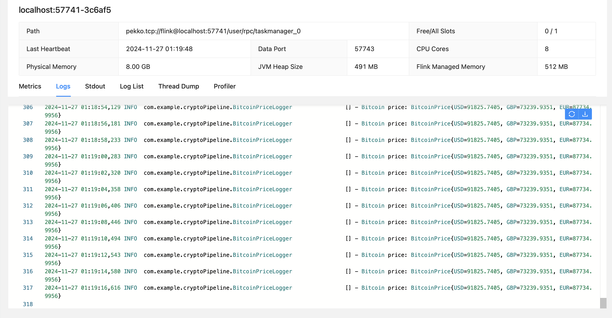

# Bitcoin Price Logger

This project is a **real-time cryptocurrency price logger** built using **Apache Flink**. It fetches live Bitcoin price data (in USD, GBP, and EUR) from the [CoinDesk API](https://api.coindesk.com/v1/bpi/currentprice.json) and logs the prices.

## Features

- Real-time data streaming using Apache Flink.
- Fetches Bitcoin prices from the CoinDesk API.
- Demonstrates the use of custom source functions and logging in Flink.

## Prerequisites

1. **Java**: JDK 8 or above.
2. **Apache Flink**: Installed and configured. [Download Flink](https://flink.apache.org/downloads.html).
3. **Maven**: For building the project.

## Getting Started

### 1. Clone the Repository

```bash
git clone https://github.com/your-repo/bitcoin-price-logger.git
cd bitcoin-price-logger
```

### 2. Build the Project

Use Maven to build the project:

```bash
mvn clean package
```

### 3. Run the Application

Deploy and run the Flink job:

```bash
/path/to/flink/bin/flink run target/cryptoPipeline-1.0-SNAPSHOT.jar
```

### 4. Output

The application logs Bitcoin prices in the following format:

```
2024-11-27 01:18:41,389 INFO  com.example.cryptoPipeline.BitcoinPriceLogger                [] - Bitcoin price: BitcoinPrice{USD=91799.5834, GBP=73219.0724, EUR=87710.0038}
```




---

## Project Structure

```
src/main/java/com/example/cryptoPipeline/
    |-- BitcoinPriceLogger.java    # Main application entry point
    |-- BitcoinPrice.java          # POJO representing Bitcoin price data
```

## Highlights

- **Flink Skills**:
  - Custom source functions.
  - Integration with external APIs.
  - Real-time data streaming and processing.
- **Logging**:
  - Configured with Log4j 2 for structured output.

---

## Future Enhancements

- Add support for more cryptocurrencies.
- Extend the application to write data to a database or a real-time dashboard.